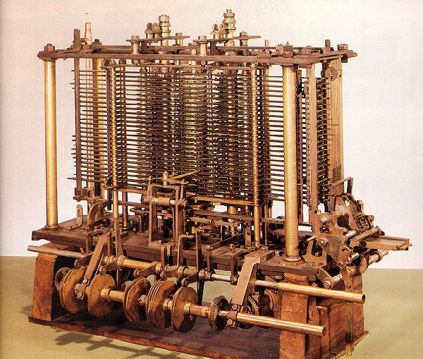

# Introducción

## Una breve reseña histórica sobre la computación

[//]: # https://www.significados.com/computacion/

La palabra **computación** proviene del latín *computatio*, que deriva del verbo *computare*, cuyo significado es "enumerar cantidades". Computación, en este sentido, designa la acción y efecto de computar, realizar una cuenta, un cálculo matemático. De allí que antiguamente computación fuese un término usado para referirse a los cálculos realizados por una persona con un instrumento expresamente utilizado para tal fin (como el ábaco, por ejemplo) o sin él. En este sentido, la computación ha estado presente desde tiempos ancestrales.

A través de la historia, la computación progresó de manera relativamente lenta. En 1623, el alemán Wilhelm Schickard inventó la primera calculadora mecánica, capaz de realizar cómputos aritméticos sencillos. Este, y otros modelos posteriores, eran puramente mecánicos, sin motores ni otras fuentes de energía. El operador ingresaba números ubicando ruedas de metal en posiciones particulares y al girarlas otras partes de la máquina se movían y mostraban el resultado.

```{r calculadora, out.width='50%', fig.show='hold', fig.cap='Réplica de la máquina calculadora de Schickard.', echo=FALSE, fig.align="center"}
knitr::include_graphics('images/01_calculadora.JPG')
```

Durante la Revolución Industrial, el rápido crecimiento de la tecnología hizo posible considerar nuevas formas para realizar cálculos matemáticos, tomando provecho de que las máquinas de vapor podían proveer energía para hacer funcionar nuevos mecanismos. En este tiempo, se destacó el matemático británico Charles Babbage, quien diseñó dos tipos de máquinas calculadoras, una para crear tablas de funciones matemáticas (llamada *máquina diferencial*), y otra que concibió como de uso general, capaz de realizar distintas funciones de acuerdo a cómo fuese "programada" (*máquina analítica*). La operación de esta máquina era controlada por un patrón de perforaciones hechas sobre una tarjeta que la misma podía leer. Al cambiar el patrón de las perforaciones, se podía cambiar el comportamiento de la máquina para que resuelva diferentes tipos de cálculos. Si bien no llegó a concretar sus diseños en vida y fueron finalizados por otras personas, sentó bases importantes en la historia de la computación.

```{r maqanalitica, out.width='50%', fig.show='hold', fig.cap='La máquina analítica de Babbage.', echo=FALSE, fig.align="center"}

```

En 1890, Herman Hollerith utilizó tarjetas perforadas para automatizar la tabulación de datos para el censo de Estados Unidos, y con el fin de comercializar esta tecnología fundó una compañía que terminaría siendo la famosa International Business Machine (IBM). Sin embargo, la visión de Babbage de una computadora programable no se hizo realidad hasta los años 1940, cuando el advenimiento de la electrónica hizo posible superar a los dispositivos mecánicos existentes. El primer prototipo de una computadora electrónica fue armado por John Atanasoff y Clifford Barry en Iowa State College en 1939, que contaba con 300 tubos de vacíos, componentes electrónicos que pueden modificar una señal eléctrica mediante el control del movimiento de los electrones produciendo una respuesta.


```{r berry, out.width='50%', fig.show='hold', fig.cap='Réplica de la máquina calculadora de Schickard.', echo=FALSE, fig.align="center"}
knitr::include_graphics('images/03_berry.jpg')
```

La primera computadora electrónica a gran escala fue la ENIAC, *Electronic Numerical Integrator and Computer*, completada por Presper Eckert y John Mauchly en Pennsylvania. Tenía más de 18000 tubos de vacío, ocupaba una sala de 9x15 metros y era controlada conectando ciertos cables en un panel, pero poder programarla resultó ser más difícil de lo que los inventores esperaban. Sin embargo, un gran avance se produjo en 1946, cuando John von Neumann en Princeton propuso que los programas, es decir, las instrucciones para que la máquina opere, y los datos necesarios podrían ser representados y guardados en una memoria interna.

```{r eniac, out.width='50%', fig.show='hold', fig.cap='La ENIAC en Filadelfia, Pennsylvania.', echo=FALSE, fig.align="center"}
knitr::include_graphics('images/04_eniac.jpg')
```

Desde entonces, la computación ha evolucionado muy rápidamente, con la introducción de nuevos sistemas y conceptos. Algunos historiadores dividen al desarrollo de las computadoras modernas en cuatro generaciones:

- **Primera generación**: se trata de las computadoras electrónicas que usaban tubos de vacío para su circuito interno como la de Atanasoff. 
- **Segunda generación**: nació a partir de 1947 con el desarrollo del *transistor*, un dispositivo electrónico semiconductor que entrega una señal de salida en respuesta a una señal de entrada, mucho más pequeño que los tubos de vacío y que consumen menos energía eléctrica. Aún así, una computadora podía tener cientos de miles de transistores, ocupando mucho espacio. 
- **Tercera generación**: se inició en 1959 con el desarrollo de un circuito integrado ("chip") que se trata de una pequeña placa de silicio sobre el cual se imprime un gran número de transistores conectados. La primera computadora de este estilo fue de IBM en 1960.
- **Cuarta generación**: comenzó en 1975 cuando los avances tecnológicos permitieron construir la unidad entera de procesamiento de una computadora sobre un único chip de silicio. Los procesadores que consisten de un único chip se llaman *microprocesadores* y son utilizados en la mayoría de las computadoras de hoy.

```{r evolucion, out.width='50%', fig.show='hold', fig.cap='De derecha a izquierda: un tubo de vacío, un transistor y un chip.', echo=FALSE, fig.align="center"}
knitr::include_graphics('images/05_tubovacio_transistor_chip.jpg')
```

## Software y hardware

La computadora en sí misma es sólo una parte de la historia. La máquina física que uno puede comprar y llevar al escritorio de casa es un ejemplo de **hardware**. Es tangible. Pero para que una computadora pueda cumplir con el propósito general de servir para una variada gama de tareas, debe ser **programada**. El acto de programar una computadora consiste en proveer un conjunto de instrucciones - un **programa** - que especifica todos los pasos necesarios para resolver un problema que se le asigna. Estos programas generalmente se conocen como **software**, y es la conjunción de ambos, hardware y software, la que le da vida a la computación.

```{r hardvssoft, out.width='50%', fig.show='hold', fig.cap='Representación de la diferencia entre hardware y software.', echo=FALSE, fig.align="center"}
knitr::include_graphics('images/06_hardsoft.jpg')
```

A diferencia del hardware, el software es una entidad abstracta, intangible. Se trata de una secuencia de pasos simples y operaciones, especificadas en un lenguaje que el hardware puede interpretar. En nuestro **Taller de Programación** nos concentraremos en el diseño de la solución de un problema y cómo transmitírsela a la computadora para que la misma pueda ejecutarla.

