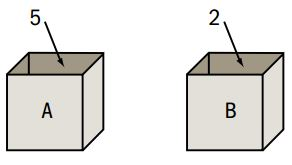

# Elementos para la creación de algoritmos

## Procesador, ambiente y acciones

Hemos definido a un algoritmo como una lista de instrucciones que serán traducidas con un lenguaje de programación para ser ejecutadas por computadora. En este sentido, el concepto físico de la máquina o computadora hacer referencia a la necesidad de contar con un **procesador** para resolver el problema. Se define como **procesador** a todo agente capaz de entender las órdenes del programa y ejecutarlas.

Para cumplir con esto, el procesador empleará ciertos recursos que forman parte del sistema en el cual se ejecuta el programa. Por ejemplo, utilizará dispositivos de almacenamiento para guardar datos o dispositivos de salida para comunicar el resultado. Todos los elementos disponibles para ser utilizados por el procesador constituyen su **entorno** o **ambiente**.

Cada una de las instrucciones que componen el algoritmo modifican el entorno de alguna manera y se denominan **acciones**.

### Ejemplo 1

- **Problema**: preparar una tortilla de 6 huevos.
- **Entorno**:  una mesa, una hornalla, una sartén, un plato, un tenedor, aceite, una fuente con huevos, un tarro de basura.
- **Procesador**: un adulto.
- **Acciones comprensibles por el procesador**: agarrar un huevo, romper un huevo en un plato, batir huevos, poner aceite, poner en la sartén, poner al fuego, retirar del fuego, tirar las cáscaras, encender el fuego.

¿Cuál es un algoritmo adecuado para solucionar este problema? Podría ser:

```{r, tidy=FALSE, eval=FALSE, highlight=FALSE, echo=T}
ALGORITMO: "Preparar una tortilla de 6 huevos"
COMENZAR
    ROMPER seis huevos en un plato
    TIRAR las cáscaras en el tacho
    BATIR los huevos
    CALENTAR aceite en la sartén
    PONER el contenido del plato en la sartén
    ESPERAR diez minutos
    RETIRAR la tortilla del fuego
    APAGAR el fuego
FIN
```

### Ejemplo 2

- **Problema**: calcular el factorial del número 5.
- **Entorno**: se dispone de una calculadora común.
- **Procesador**: un adulto.
- **Acciones comprensibles por el procesador**: pulsar teclas de la calculadora.

¿Cuál es un algoritmo adecuado para solucionar este problema? Podría ser:

```{r, tidy=FALSE, eval=FALSE, highlight=FALSE, echo=T}
ALGORITMO: "Calcular 5!"
COMENZAR
    PULSAR [ON]
    PULSAR [1]
    PULSAR [X]
    PULSAR [2]
    PULSAR [X]
    PULSAR [3]
    PULSAR [X]
    PULSAR [4]
    PULSAR [X]
    PULSAR [5]
    PULSAR [=]
    MOSTRAR la pantalla
FIN
```

### Acciones primitivas o compuestas

Las acciones del algoritmo pueden clasificarse en función de su complejidad:

- **Primitivas**: acción sencilla directamente realizable por el procesador.
- **Compuestas**: compuestas por una sucesión de acciones primitivas.

La descripción de un algoritmo en términos de acciones compuestas puede facilitar su comprensión, pero al desarrollar el programa será necesario descomponerlas en acciones primitivas que son las que realmente ejecuta el procesador. Por ejemplo, la acción compuesta en el ejemplo de la tortilla de "romper seis huevos en un plato" puede descomponerse en acciones más simples:

```{r, tidy=FALSE, eval=FALSE, highlight=FALSE, echo=T}
REPETIR 6 VECES
    TOMAR un huevo
    GOLPEAR el huevo para generar una fractura en la cáscara
    EJERCER presión sobre la cáscara
    DERRAMAR la clara y la yema sobre el plato
```

## Objetos, constantes y variables

El procesador debe manipular distintas piezas de información que llamamos **objetos** y que componen al entorno.  Según los valores que pueden representar, los objetos pueden ser de tipo:

- **Numérico**: Representan valores escalares de forma numérica y permiten realizar
operaciones aritméticas comunes. Ejemplo: 230, 2.
- **Caracter**: Representan texto, no es posible hacer operaciones
matemáticas con ellos y van entre comillas. Ejemplo: "hola", "chau123"
- **Lógicos**: Sólo pueden tener dos valores (*verdadero* o *falso*), ya que representan el resultado de la comparación entre otros objetos.

De manera general, al nombre de un objeto se le dice **identificador**, el cual es una secuencia de caracteres alfanuméricos que sirve para identificarlo a lo largo del algoritmo. Nombrar los objetos hace posible referirse a los mismos, lo cual es esencial para cualquier tipo de procesamiento simbólico.

Ciertos objetos almacenan temporalmente un valor durante la ejecución de un proceso y su contenido puede cambiar mientras corre el programa. Este tipo de objetos recibien el nombre de **variables**. Por ejemplo, en un programa creado para un comercio puede existir un objeto llamado *stock* (identificador) de tipo numérico que reprsenta la cantidad de artículos disponibles y cuyo valor se modifica cada vez que se registra una nueva venta. Podemos pensar a una variable como una caja que contiene una etiqueta con su identificador y un valor, por ejemplo, una simple letra (como "k", tipo caracter) o un valor numérico (como "2019", tipo numérico).

```{r cajas, out.width='50%', fig.show='hold', fig.cap='Las variables A y B contienen a los valores 5 y 2 respectivamente.', echo=FALSE, fig.align="center"}

```

Si un objeto tiene siempre necesariamente un valor fijo, se dice que es una **constante**. El valor es siempre el mismo para cualquier ejecución del programa, es decir, no puede cambiar de una ejecución a otra. Son ejemplos de constantes el número de meses del año, las constantes matemáticas tales como el número π, los factores de conversión de unidades de medida, etc. Las constantes pueden usarse literalmente, es decir, usando explícitamente el valor, o también a través de un objeto que asocie un identificador al valor constante (por ejemplo, asociar el nombre "pi" a la constante 3.14159265).

### Declaración de variables y constantes

Al expresar nuestros algoritmos en pseudocódigo tomaremos la costumbre de declarar al inicio del mismo las variables y constantes necesarias para resolver el problema, explicitando su identificador y determinando el tipo de valor que guarda. Muchos lenguajes de programación utilizan esta declaración para reservar en la memoria de la computadora un espacio para almacenar la información correspondiente de manera adecuada.

**En IML**. IML es un lenguaje dinámico que no requiere la declaración previa de las variables que serán utilizadas, sino que estas pueden definirse dinámicamente a lo largo del programa. Por eso, incluiremos declaración de variables y constantes sólo en los algoritmos.

### Acción de asignación

Para hacer que una variable guarde un determinado valor se recurre a una **acción de asignación**. Mediante asignaciones podemos dar valores iniciales a las variables, modificar el valor que tenían hasta el momento o guardar en ellas resultados intermedios o finales del algoritmo.

En pseudocódigo expresaremos a la asignación como se muestra en estos ejemplos:

```{r, tidy=FALSE, eval=FALSE, highlight=FALSE, echo=T}
lugarNacimiento <- "Bombal"
pesoNacimiento <- 3.423
```

Si intervienen variables en la expresión a la derecha de una acción de asignación, se usará el valor que tenga la variable en ese momento. Por ejemplo, la siguiente secuencia de acciones en un algoritmo:

```{r, tidy=FALSE, eval=FALSE, highlight=FALSE, echo=T}
meses <- 2
dias <- meses
meses <- 7
saldo <- meses
```

resultará en que las variables `meses`, `dias` y `saldo` tengan almacenados los valores 7, 2 y 7 respectivamente. Un caso particular se da cuando a una variable se le asigna el valor de una operación de la que forma parte la misma variable. Por ejemplo:

```{r, tidy=FALSE, eval=FALSE, highlight=FALSE, echo=T}
dias <- dias + 30
```

**En IML**. La asignación se realiza a través del símbolo =. El código para el ejemplo anterior es:

```{r, tidy=FALSE, eval=FALSE, highlight=FALSE, echo=T}
proc iml;
	meses = 2;
	dias = meses;
	meses = 7;
	saldo = meses;
	print meses dias saldo;
quit;
```

## Operadores

El desarrollo de un algoritmo involucra la necesidad de efectuar operaciones de distinto tipo: suma, resta, concatenación, procesos lógicos, etc. Los elementos que describen el tipo de operación a realizar entre dos objetos se denominan **operadores**.

### Operadores aritméticos

Permiten realizar operaciones matemáticas con objetos de tipo numérico.

```{r, tidy=FALSE, eval=T, highlight=T, echo=F, results = 'asis'}
library(knitr)
tabla <- matrix(c("+", "Suma",
                  "-", "Resta",
                  "*", "Multiplicación",
                  "/", "División",
                  "**", "Potenciación",
                  "MOD", "Resto de la división entera"),
                byrow = T, ncol = 2)
colnames(tabla) <- c("Signo", "Significado")
kable(tabla, caption = "Signos para operadores aritméticos que se pueden utilizar en el pseudocódigo.")
```

<!-- # funcion modulo en iml r = mod(a, q); -->

Los operadores aritméticos actúan con un orden de prioridad establecido, tal como estamos acostumbrados en matemática. Las expresiones entre paréntesis se evalúan primero. Si hay paréntesis anidados se evalúan desde adentro hacia afuera. Dentro de una misma expresión, los operadores se evalúan en este orden:

1. Potenciación
2. Multiplicación, división, módulo
3. Suma, resta

Si la expresión presenta operadores con igual nivel de prioridad, se evalúan de izquierda a derecha. Ejemplos:

```{r, tidy=FALSE, eval=FALSE, highlight=FALSE, echo=T}
4 + 2 * 4 = 12
23 * 2 / 5 = 9.2
3 + 5 * (10 - (2 + 4)) = 23
2.1 * 1.5 + 12.3 = 15.45
2.1 * (1.5 + 12.3) = 28.98
1 MOD 4 = 1
8 * (7 - 6 + 5) MOD (1 + 8 / 2) - 1 = ...
```

<!-- Rpta: 
8 * 6 MOD 5 - 1
48 MOD 5 -1
3 - 1
2
-->

**En IML**. Se utilizan los mismos símbolos, excepto para el operador módulo, cuya sintaxis es, por ejemplo, `mod(7, 4)` si se quiere obtener el resto de la división de 7 por 4.

### Operadores relacionales

Sirven para comparar dos valores de cualquier tipo y dan como resultado un valor lógico: *verdadero* ("V") o *falso* ("F").

```{r, tidy=FALSE, eval=T, highlight=T, echo=F, results = 'asis'}
library(knitr)
tabla <- matrix(c(">", "Mayor que",
                  "<", "Menor que",
                  ">=", "Mayor o igual que",
                  "<=", "Menor o igual que",
                  "=", "Igual a",
                  "^=", "Distinto a"),
                byrow = T, ncol = 2)
colnames(tabla) <- c("Signo", "Significado")
kable(tabla, caption = "Signos para operadores lógicos que se pueden utilizar en el pseudocódigo.")
```

Ejemplos:

```{r, tidy=FALSE, eval=T, highlight=T, echo=F, results = 'asis'}
tabla <- matrix(c("5 > 3", "verdadero",
                  "5 <= 3", "falso",
                  "3 * 4 = 10 + 2", "verdadero",
                  "3 * 4 ^= 15 - 4", "verdadero"),
                byrow = T, ncol = 2)
colnames(tabla) <- c("Operación relacional", "Resultado")
kable(tabla, caption = "Ejemplos de la utilización de operadores relacionales.")
```

**En IML**. Se usan estos mismos símbolos.

### Operadores lógicos

Mientras que los operadores relacionales comparan cualquier tipo de valores, los operadores lógicos sólo toman operandos de tipo lógico y producen también un resultado lógico. Los operadores lógicos que utilizaremos son **Y**, **O** y **NO**. 

- El operador lógico **Y** devuelve un valor **verdadero** sólo si son verdaderas las dos expresiones que vincula. Ejemplo: (3 > 2) Y (3 > 5) ≡ V Y F ≡ F.
- El operador lógico **O** devuelve un valor **verdadero** si al menos una de las dos expresiones que vincula es verdadera. Ejemplo: (3 > 2) O (3 > 5) ≡ V O F ≡ V.
- El operador lógico **NO**, niega un valor lógico, es decir, devuelve el opuesto. Ejemplo: NO (3 > 2) ≡ NO V ≡ F.

Las **tablas de la verdad** se utilizan para mostrar el resultado de los distintos tipos de operaciones lógicas:

```{r, tidy=FALSE, eval=T, highlight=T, echo=F, results = 'asis'}
tabla <- matrix(c("F", "Y", "F", "F",
                  "F", "Y", "V", "F",
                  "V", "Y", "F", "F",
                  "V", "Y", "V", "V",
                  "F", "O", "F", "F",
                  "F", "O", "V", "V",
                  "V", "O", "F", "V",
                  "V", "O", "V", "V",
                  "", "NO", "F", "V",
                  "", "NO", "V", "F"
                  ),
                byrow = T, ncol = 4)
colnames(tabla) <- c("Valor1", "Operador", "Valor2", "Resultado")
kable(tabla, caption = "Tabla de la verdad.")
```

Ejemplo: expresar con símbolos la expresión "x no es igual a 2 ni a 3".

Expresiones correctas:

```{r, tidy=FALSE, eval=FALSE, highlight=FALSE, echo=T}
x ^> 2 Y x ^> 3
NO(x = 2 O x = 3)
```

Expresión incorrecta:

```{r, tidy=FALSE, eval=FALSE, highlight=FALSE, echo=T}
x ^= 2 O x ^= 3
```

Las Leyes de Morgan nos ayudan a trabajar en este tipo de casos:

- **NO (Valor1 O Valor2)** *es equivalente a* **NO Valor1 Y NO Valor2**
- **NO (Valor1 Y Valor2)** *es equivalente a* **NO Valor1 O NO Valor2**

Otra consideración es que expresiones que tienen sentido en matemática, pueden no tenerlo en programación y deben ser re estructuradas en las formas antes vistas. Por ejemplo, si queremos evaluar si es `V` o `F`la expresión `0 < x < 10`, debemos evaluar `0 < x Y x < 10`.

**En IML**. El operador Y se escribe como "&", el operador O es "|" y el operador NO es "^".

## Entrada y salida de información

En la resolución de problemas puede ser necesario requerir que un usuario provea información, y registrar la misma como un valor que debe ser asignado a una variable. Para esto podemos utilizar la acción `LEER` dentro del algoritmo. Cuando deseamos mostrar un resultado en un mensaje empleamos la acción `ESCRIBIR`. Las palabras o frases literales que se desean mostrar en el mensaje deben estar encerradas entre comillas porque son cadenas de texto, mientras que si se desea mostrar el valor de una variable se debe escribir su identificador sin comillas.

**En IML**. La acción `LEER` la ejecutaremos mediante la asignación directa de un valor a una variable a través del símbolo "=". La acción `ESCRIBIR` será ejecutada a través de la sentencia `print` para obtener un resultado en la ventana de Output.

## Empleo de comentarios en el algoritmo

A medida que los algoritmos se hacen más complejos, suele ser necesario añadir en el mismo ciertos comentarios que no son acciones que el procesador debe ejecutar, sino que cumplen con la función de explicar alguna característica del algoritmo a otra persona que lo esté leyendo (o a uno mismo si lo leemos nuevamente en el futuro).

Cada vez que deseemos incluir un comentario, lo haremos en una línea que comience con el símbolo "\\\\".

## Ejemplo

Los conceptos enunciados anteriormente pueden verse ejemplificados en el siguiente algoritmo para calcular el área de un círculo

```{r, tidy=FALSE, eval=FALSE, highlight=FALSE, echo=T}
ALGORITMO: "Calcular área de un círculo"
COMENZAR
    CONSTANTE numérica pi
    VARIABLE numérica radio, area
    pi <- 3.1416
    LEER radio
    area <- pi * radio ** 2
    ESCRIBIR "El área del círculo es " area
FIN
```

**En IML**:

```{r, tidy=FALSE, eval=FALSE, highlight=FALSE, echo=T}
/* PROGRAMA: Calcular área de un círculo */
proc iml;
	pi = 3.14159265358979;
	radio = 5;
	area = pi * radio ** 2;
	print "El área del círculo es " area;
quit;
```

