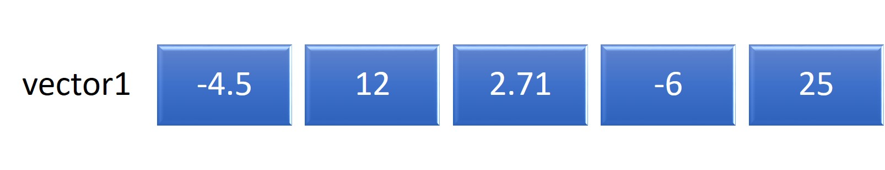
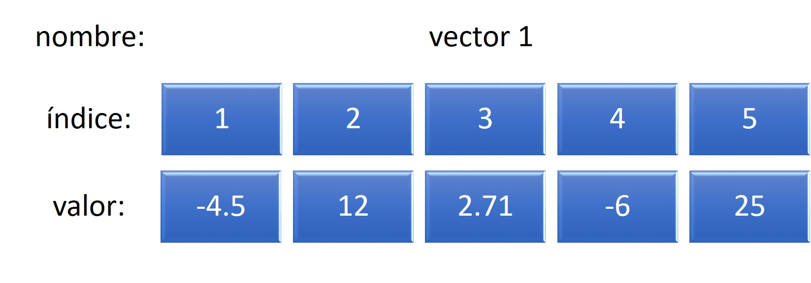
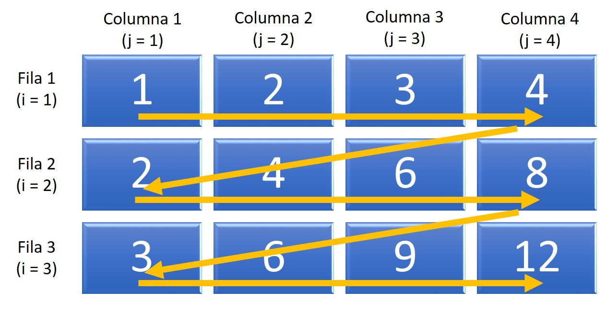
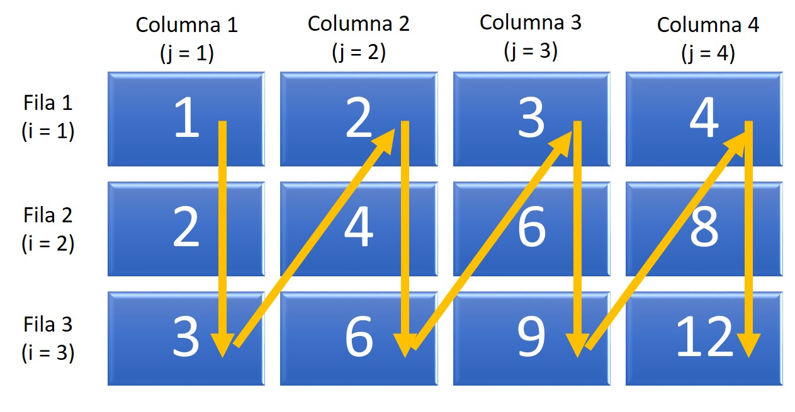
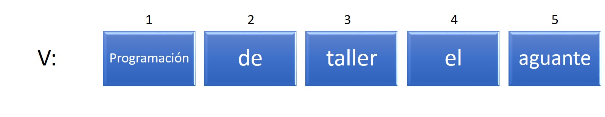
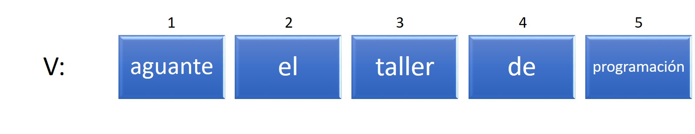
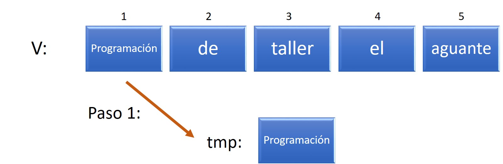
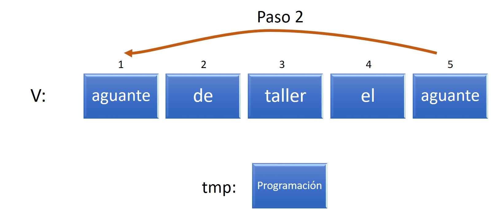
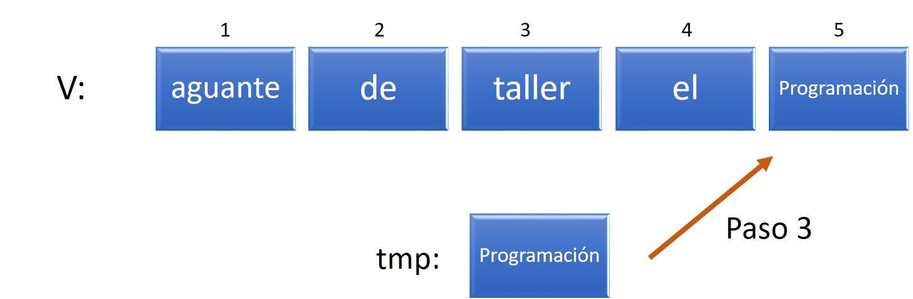

# Estructuras de Datos

Hasta ahora todos los algoritmos que hemos desarrollado hacen uso de objetos con datos individuales, que representaban un número, una cadena de texto o un valor lógico. Sin embargo, la verdadera utilidad de la computación radica en poder trabajar con conjuntos de datos. En este capítulo introduciremos el concepto de un **arreglo** (o *array*) que es una colección ordenada de valores del mismo tipo. Los arreglos son muy útiles para almacenar información en la memoria de la computadora, organizando valores que estén relacionados entre sí de alguna manera, por ejemplo, una lista de precios, los meses del año, el listado de calificaciones de los alumnos, etc.

Un **arreglo** se define entonces como una colección de valores individuales con dos características fundamentales:

- *Ordenamiento*: los valores individuales pueden ser enumerados en orden, debe ser posible identificar en qué posición del arreglo se encuentra cada valor.
- *Homogeneidad*: los valores individuales almacenados en un arreglo son todos del mismo tipo (numérico, caracter, lógico).

Antes de poder utilizar un arreglo, hay que reservar una zona de la memoria para su uso, así como definir el número de parámetros necesarios para acceder a cada elemento de la estructura, es decir, **dimensionarlos**, lo cual permite clasificar a los arreglos en *unidimensionales*, *bidimensionales* o *multidimensionales*.

## Arreglos unidimensionales

Un **arreglo unidimensional** representa lo que habitualmente conocemos con un **vector** y por lo tanto también se lo llama de esa manera. Un **vector** tiene *n* elementos ordenados todos del mismo tipo. Un ejemplo de un vector de tipo numérico llamado *vector1* con 5 elementos puede ser:

```{r vector1, out.width='80%', fig.show='hold', fig.cap='Ejemplo vector numérico', echo=FALSE, fig.align="center"}

```

Un ejemplo de un vector de tipo caracter llamado *vector2* con 4 elementos puede ser:

```{r vector2, out.width='80%', fig.show='hold', fig.cap='Ejemplo vector caracter', echo=FALSE, fig.align="center"}

```

Los elementos en cada uno de estos vectores ocupan una determinada posición y pueden ser accedidos a través del uso de **índices**, expresados con corchetes al lado del nombre del vector. Por ejemplo, la acción `ESCRIBIR vector1[3]` nos mostrará el valor 2.71.

```{r vector1bis, out.width='80%', fig.show='hold', fig.cap='Ejemplo vector numérico con posiciones indexadas', echo=FALSE, fig.align="center"}

```

Como todas las variables que empleamos en nuestros algoritmos, los vectores deben ser declarados en el mismo y su tamaño debe ser especificado al comenzar. Esto se realiza a través de la acción `DIMENSIONAR`. Por ejemplo, el *vector1* visto anteriomente puede ser creado de la siguiente forma:

```{r, tidy=FALSE, eval=FALSE, highlight=FALSE, echo=T}
DIMENSIONAR numérico vector1(5)
vector1[1] <- -4.5
vector1[2] <- 12
vector1[3] <- 2.71
vector1[4] <- -6
vector1[5] <- 25
```

Cuando declaramos un vector que usaremos más adelante, especificamos cuántos elementos entrarán en él poniendo su dimensión entre paréntesis al lado del nombre.

Podemos asignar valores a las posiciones del vector empleando estructuras de control iterativas, por ejemplo:

```{r, tidy=FALSE, eval=FALSE, highlight=FALSE, echo=T}
DIMENSIONAR numérico vector3(30)
PARA i DESDE 1 HASTA 30 HACER
    vector3[i] <- i * 2
FIN PARA
```

En este ejemplo, la variable `i` se usa como índice para el espacio en el vector que será modificado y también para calcular el valor por asignar, resultando en un vector con los números 2, 4, 6, ..., 60. 

En el próximo ejemplo, se deja que el usuario determine la dimensión del vector y que provea cada uno de los valores para el mismo:

```{r, tidy=FALSE, eval=FALSE, highlight=FALSE, echo=T}
VARIABLE numérico tam
LEER tam
DIMENSIONAR numérico vector4(tam)
PARA i DESDE 1 HASTA tam HACER
    LEER vector4[i]
FIN PARA
```

## Arreglos bidimensionales

Un **arreglo bidimensional** representa lo que habitualmente conocemos con una **matriz** y también lo podemos llamar de esa forma. A diferencia de los vectores, las matrices requieren dos índices o parámetros para acceder a sus elementos, sobre los cuales nos referimos como **fila** y **columna**. Se pueden utilizar dos estructuras *PARA... FIN PARA* anidadas para recorrer todos los elementos de la matriz, como se muestra en el siguiente ejemplo:

```{r, tidy=FALSE, eval=FALSE, highlight=FALSE, echo=T}
DIMENSIONAR numérico matriz1(3, 4)
PARA i DESDE 1 HASTA 3 HACER
    PARA j DESDE 1 HASTA 4 HACER
        matriz1[i, j] <- i * j
    FIN PARA
FIN PARA
```

```{r matriz1, out.width='80%', fig.show='hold', fig.cap='Ejemplo: matriz1', echo=FALSE, fig.align="center"}

```

En el ejemplo anterior los valores fueron asignados recorriendo la matriz por filas como lo indican las flechas. Otra posibilidad es recorrer la matriz por columna en primer instancia, para lo cual la estructura *PARA... FIN PARA* que representa a los índices de las columnas debe ser la externa y la que representa a los índices de columnas, la interna:

```{r, tidy=FALSE, eval=FALSE, highlight=FALSE, echo=T}
DIMENSIONAR numérico matriz1(3, 4)
PARA j DESDE 1 HASTA 4 HACER
    PARA i DESDE 1 HASTA 3 HACER
        matriz1[i, j] <- i * j
    FIN PARA
FIN PARA
```

```{r matriz1bis, out.width='80%', fig.show='hold', fig.cap='Ejemplo: matriz1 recorrida por columnas', echo=FALSE, fig.align="center"}

```

## Arreglos multidimensionales

Un **arreglo multidimensional** contiene más de dos dimensiones. Aunque los vectores y matrices son los tipos de arreglos más usados, podemos emplear tantos índices para localizar los elementos del arreglo como estimemos necesarios. La representación matemática o visual ya no es tan sencilla. Para interpretarlos o saber cuándo usarlos, pensamos que cada uno de las dimensiones representa una característica, condicionante o parámetro definidor del elemento.

Por ejemplo, si se desea contar el número de autos que ingresaron a una playa de estacionamiento por hora a lo largo de varios años, podríamos utilizar un arreglo donde la primera dimensión indique el año, la segunda el mes, la tercera el día y la cuarta la hora. Si llamamos a este arreglo `numeroAutos`, el elemento `numeroAutos[2, 4, 23, 14]` contendrá el número de autos que ingresaron a la hora 14, del día 23, en el mes 4 del segundo año.

## Ejemplo: invertir los elementos de un vector

Nos planteamos el problema de dar vuelta los elementos pertenecientes a un vector, de manera que el primer elemento pase a ser el último, el segundo pase al penúltimo lugar, etcétera.

Por ejemplo, dado el vector `v`:

```{r inv1, out.width='80%', fig.show='hold', fig.cap='Vector v original', echo=FALSE, fig.align="center"}

```

Queremos modificarlo para obtener:

```{r inv2, out.width='80%', fig.show='hold', fig.cap='Vector v reordenado', echo=FALSE, fig.align="center"}

```

Si bien podemos pensar en distintas formas para resolver este problema, probablemente la más sencilla requiere que intercambiemos de a dos los valores en ciertas posiciones del vector, por ejemplo, el primero y el último. Para esto podemos emplear una variable auxiliar para guardar el valor de alguna de las celdas temporariamente (por eso lo vamos a llamar `tmp`) y poder realizar el intercambio:

```{r inv3, out.width='80%', fig.show='hold', fig.cap='Vector v reordenado', echo=FALSE, fig.align="center"}

```


```{r inv4, out.width='80%', fig.show='hold', fig.cap='Vector v reordenado', echo=FALSE, fig.align="center"}

```


```{r inv5, out.width='80%', fig.show='hold', fig.cap='Vector v reordenado', echo=FALSE, fig.align="center"}

```

Ahora sólo resta realizar el mismo procedimiento para los valores de las posiciones 2 y 4. Como el número de elementos en el vector es impar, el valor en la posición central queda en su lugar. Podemos definir el siguiente algorimo para resolver este problema de manera general:

```{r, tidy=FALSE, eval=FALSE, highlight=FALSE, echo=T}
ALGORITMO: "Invertir (dar vuelta) los elementos de un vector"
COMENZAR
    
    \\ Declarar variables
    VARIABLE numérico n
    VARIABLE caracter tmp
    LEER n
    DIMENSIONAR caracter v(n)
    
    \\ Asignar valores al vector
    PARA i DESDE 1 HASTA n HACER
        LEER v[i]
    FIN PARA
    
    \\ Reordenar
    PARA i DESDE 1 HASTA ENTERO(n / 2) HACER
        tmp <- v[i]                 \\ Paso 1
        v[i] <- v[n - i + 1]        \\ Paso 2
        v[n - i + 1] <- tmp         \\ Paso 3
    FIN PARA
    
    \\ Mostrar el vector reodenado
    PARA i DESDE 1 HASTA n HACER
        ESCRIBIR v[i]
    FIN PARA
    
FIN
```

El código correspondiente en SAS/IML es:

```{r, tidy=FALSE, eval=FALSE, highlight=FALSE, echo=T}
/* Invertir (dar vuelta) un vector */
proc iml;
	v = {"programacion" "de" "taller" "el" "aguante"};
	n = ncol(v);
	do i = 1 to int(n / 2);
		tmp = v[i];
		v[i] = v[n - i + 1];
		v[n - i + 1] = tmp;
	end;
	print v;
quit;
```

